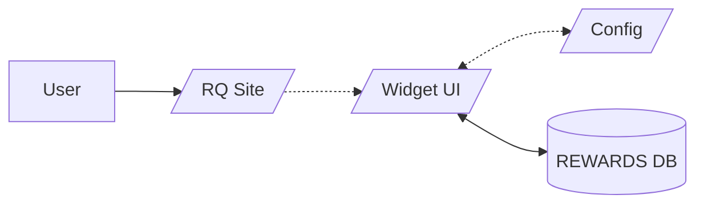

# Rip City Rewards

## Introduction
This portfolio case study focuses on a project undertaken in collaboration with Rose Quarter's Director of Arena Marketing. The objective of the project was to create a centralized webpage that would enable the provision of a generic code, granting access to discount links for both the Trail Blazers and the Rose Quarter. This solution aimed to streamline the process for partners, eliminating the need for separate codes for each entity and simplifying the user experience.

This case study details a project done with the Director of Arena Marketing at Rose Quarter. The goal was to create a webpage for a code that could provide discount links for both the Trail Blazers and Rose Quarter. This solution simplified the process for partners and improved the user experience by eliminating the need for separate codes for each entity.

## Client Overview:
The Rose Quarter is a vibrant sports and entertainment district located in the heart of Portland, Oregon. It encompasses the Moda Center, home of the NBA's Portland Trail Blazers, as well as the Veterans Memorial Coliseum and several other venues. The Rose Quarter Director of Arena Marketing sought to enhance the experience for partners by providing a unified platform that combines access to both the Trail Blazers' and Rose Quarter's discount links, eliminating the complexity of managing separate codes.

## Challenge:
The primary challenge faced by the Rose Quarter Director of Arena Marketing was the need to provide partner organizations with a simplified process for accessing discount links. Previously, partners had to manage two separate codes - one for the Trail Blazers and another for the Rose Quarter. This led to confusion and inconvenience for partners, requiring them to keep track of multiple codes and URLs. The client sought a solution that would consolidate these codes into a single, easily accessible page, enhancing partner satisfaction and promoting the Rose Quarter brand.

### Solution Approach:
1. **Webflow Limitation:** The Rose Quarter's website was built with Webflow, which limited the development of a custom application. To overcome this limitation, I proposed creating a widget that could be embedded on the webpage, providing the desired functionality within the existing framework.
2. **Widget Development Process:** As the development of the widget was a new endeavor for the Portland Trail Blazers, I established a process and tech stack for its creation and maintenance. This ensured efficient development and seamless integration with the existing infrastructure.
3. **Design Component Library:** To facilitate collaboration with the Marketing Manager and key stakeholders, I developed a mini design component library in Figma. This allowed us to present wireframes and mocked-up widget views, providing a visual representation of the proposed solution and enabling feedback and iteration.
4. **Trail Blazers Code System:** The Trail Blazers code system presented a complex challenge. To address this, we collaborated with the Business Intelligence team responsible for managing the codes. Working closely with team member Travis Rockey, who built the database, we gained insights into the intricacies of the existing code system and developed strategies for its integration into the widget.
5. **API Development:** Utilizing Next.js Routes and Prisma, we developed a custom API that served as the middleware between the database and the widget. This allowed for seamless data retrieval and interaction, ensuring a smooth user experience for partners.
6. **Integration and Connectivity:** We connected the API to the database, establishing a robust and secure connection. Furthermore, we linked the API to the widget, enabling real-time updates and ensuring that partners always had access to the latest discount links and information.

## Program Tech Basic Overview

## Results:
The implementation of the centralized discount link page, utilizing the widget and custom API, yielded significant results for the Rose Quarter and its partner organizations. 

These include:
1. Simplified Partner Experience: Partners now have a user-friendly and centralized platform to access discount links for both the Trail Blazers and the Rose Quarter. The embedded widget provides a seamless and intuitive experience, reducing confusion and improving partner satisfaction.
2. Efficient Administration: The Rose Quarter's Director of Arena Marketing benefits from a simplified process for managing discount links. Updates and modifications can be made effortlessly through the widget, saving time and effort.
3. Successful Integration: Despite the limitations imposed by the Webflow platform, the widget and API seamlessly integrate with the existing infrastructure, showcasing the ability to overcome technical challenges and deliver effective solutions.

## Conclusion:
The creation of the Rose Quarter discount link page, leveraging the widget and custom API, successfully addressed the challenges faced by the Rose Quarter's Director of Arena Marketing. 

By consolidating Trail Blazers and Rose Quarter discount links into a single, embedded widget, we simplified the partner experience, reduced administrative complexity, and enhanced the Rose Quarter brand image. 

The successful implementation of this solution, despite the limitations of the Webflow platform, exemplifies my ability to deliver innovative and effective digital solutions tailored to the unique needs of our clients.